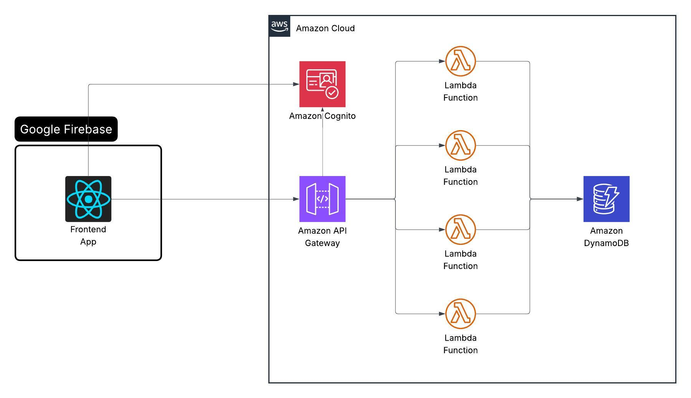

# Travel Wishlist CRUD

A simple challenge: build a **travel wishlist** with Create, Read, Update, and Delete operations.

**Live site:** https://travel-assistant-18114.web.app/

## Architecture

- **Frontend:** React (with Google Firebase)
- **Auth:** Amazon Cognito
- **API:** Amazon API Gateway → Lambda
- **Data:** Amazon DynamoDB

## CI/CD

Two GitHub Actions workflows handle continuous deployment. Both trigger on pushes to `main` or `staging` and deploy to the corresponding environment automatically.

| Branch    | Environment | API Region |
| --------- | ----------- | ---------- |
| `main`    | prod        | us-east-1  |
| `staging` | staging     | us-east-2  |

### API (`deploy-api.yml`)

Triggered by changes under `api/**` or `shared/**`.

1. Installs dependencies with Bun
2. Resolves stage (`prod` / `staging`) and AWS region from the branch name
3. Runs `serverless deploy --stage <stage>` from the `api/` directory

Required secrets: `SERVERLESS_ACCESS_KEY`, `AWS_ACCESS_KEY_ID`, `AWS_SECRET_ACCESS_KEY`.

### Client (`deploy-client.yml`)

Triggered by changes under `client/**` or `shared/**`.

1. Installs dependencies with Bun
2. Builds the Vite app injecting runtime env vars from secrets
3. Deploys to Firebase Hosting — channel `live` for `main`, channel `staging` for `staging`

Required secrets: `FIREBASE_SERVICE_ACCOUNT_TRAVEL_ASSISTANT_18114`, `VITE_COGNITO_USER_POOL_ID`, `VITE_COGNITO_USER_POOL_CLIENT_ID`, `VITE_API_URL`.
